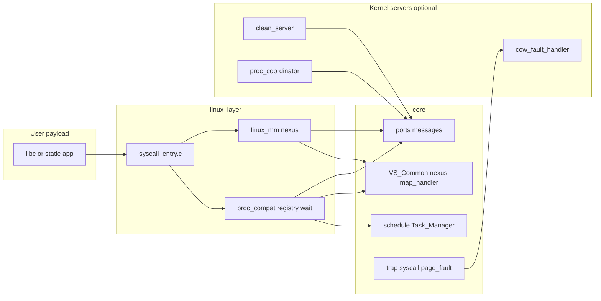

# 架构：混合内核 + 可演进微内核

## 1. 分层

- **linux_layer**：Linux 语义（`fork`/`wait`/`mmap` 标志解析、错误码、`brk` 游标等）。
- **core**：调度、IPC 原语、地址空间对象、nexus、页表操作、trap 分发。
- **servers**：与现有 [`servers/clean_server.c`](../../servers/clean_server.c) 同构的内核线程 + 端口；按需新增。

## 2. 原则：能直接调 core 则不调 IPC

- **页级 / vspace 级**：`get_free_page`、`free_pages`、`map`、`unmap`、nexus 树更新——在 **当前 syscall 上下文** 内 **直接调用 core**（持 `nexus_lock` / `vspace_lock` 等），避免无谓 RPC。
- **何时用 IPC**：全局 **单序列** 策略（pid 分配、父子表、wait 队列的 **可选** 集中化）、或 **明确要避免锁序爆炸** 的子系统；且 **处理线程不能是发起者自身**（防止同步自等死锁）。

## 3. IPC 串行化 vs 显式锁

| 手段 | 适用 |
|------|------|
| **单消费者 server + 请求/响应** | 全局进程登记、`fork` 记账（可选）、与 clean_server 类似的跨 CPU 回收协调的 **策略面** |
| **细粒度锁（core 已有）** | nexus、`vspace_lock`、`sched_lock`、PMM zone 锁 |
| **per-CPU 数据** | 当前线程/调度队列（见 `doc/ai/INVARIANTS.md`） |

**演进**：阶段 1 用 `linux_layer` 内 **一把大锁或分区锁** 维护 `proc_registry`；阶段 2 将 **同一数据结构的操作** 迁到 `proc_coordinator` 单线程，**消息格式**可预先按阶段 2 设计，减少二次重写。

## 4. 与微内核的关系

- 今日：**策略在 linux_layer，原语在 core，部分工作在 servers**。
- 明日：`proc_coordinator` / `cow_fault_handler` 可迁 **用户态**，只要 **端口能力与消息布局** 稳定；core 只保留能力检查与映射操作。

## 5. SMP 与 vspace

- nexus / `map_handler` 的 **每 CPU `map_vaddr` 窗口** 约束仍然存在：在 **任意 CPU** 上遍历页表时须使用 **当前 CPU 的 `Map_Handler`**（见 `doc/ai/INVARIANTS.md` 与 core 中 nexus 相关修复方向）。
- **fork/COW** 的 **执行** 仍可能需要在 **vspace owner CPU** 或与 **统一 MM API** 协调；`MM_AND_COW.md` 单独列「必须在 owner 上完成的步骤」。

## 6. 错误与可中断

- 阻塞类 syscall（`wait4`、将来 `pause` 等）需约定：与 `thread_status_block_*`、信号（若实现）之间的 **EINTR** 行为；在 `SYSCALLS.md` 按项勾选。
