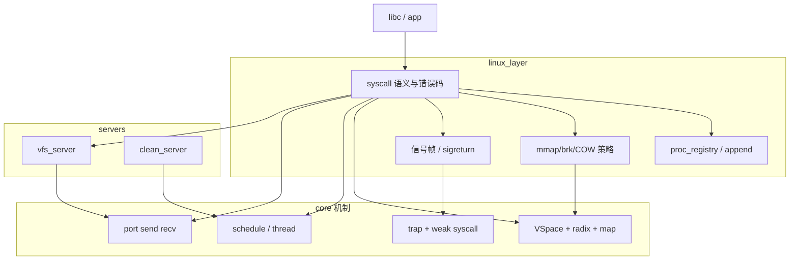

# Linux 兼容层：目标、边界与 core 契约

**受众：** 维护者规划与审查（非 syscall 实现手册）。  
**机制细节：** core 调用顺序见 [`core/docs/USING_CORE.md`](../../core/docs/USING_CORE.md)；虚存策略见 [`MM_AND_COW.md`](MM_AND_COW.md)；syscall 清单见 [`SYSCALLS.md`](SYSCALLS.md)。

---

## 1. 总目标

在 **方案 A（混合内核）** 下，用 [`linux_layer/`](../../linux_layer/) + 可选 [`servers/`](../../servers/) 实现 **尽量接近 Linux 的 syscall 语义**，支撑：

| 档位 | 含义 | 主要工作位置 |
|------|------|----------------|
| **M1** | 单进程/多进程、mmap、wait、嵌入式 ELF | compat（Phase 1 已覆盖大部分） |
| **M2** | exec、initramfs/VFS、基本 shell | compat + `vfs_server` |
| **M3** | 动态链接 libc、pthread、futex 类 | compat + **少量 core 原语（见 §5）** |
| **M4** | SMP 下多线程同地址空间、压力测例 | compat 生命周期政策 + **core TLB/quiesce** |

**不追求：** 在 core 内复刻 Linux（无独立 VMA 子系统、无完整 swap）。**不实现 `cancel_ipc`**；可取消的 IPC 等待用专用 port + `ipc_try_send_msg` 协议消息（见 `core/docs/ipc.md`）。

**syscall 数量** 是结果，不是目标；**语义闭环 + 测例** 才是目标（见 [`USER_TESTS.md`](USER_TESTS.md)）。

---

## 2. 谁做什么

| 层 | 负责 | 不负责 |
|----|------|--------|
| **linux_layer** | Linux 标志/错误码、`linux_*_append`、radix 上的 mmap/exec/COW **策略**、信号投递与 Path A 返回、fd 语义（对接 VFS） | 调度算法、radix 锁实现、port 无锁队列 |
| **servers** | 需全局串行或独立栈的服务（VFS、物理线程回收） | syscall 分发表 |
| **core** | 线程/任务、`VSpace` 对象、页表与 radix **机制**、trap、IPC 传输 | `pid` 树、VMA 链表、路径解析、`SA_*` 语义 |

---

## 3. compat 必须守住的规范（政策级）

以下由 **linux_layer 保证**；core 只提供检查/原语，不替你做 Linux 策略。

### 3.1 地址空间生命周期（exec / exit / munmap）

| 规则 | 说明 |
|------|------|
| **Quiesce** | 在 `vspace_clear_user_mappings` 或最终 `del_vspace` 之前，同 task 内 **不得** 再有其它可运行线程绑定该 `vs`（当前线程可 exempt，供 in-place exec）。 |
| **Exec 顺序** | 先结束/脱离 sibling 线程 → 再 `vspace_clear` → 再 `load_elf_to_vs` → Path A 返回用户态（见 [`SYSCALL_USER_RETURN_AND_EXECVE.md`](SYSCALL_USER_RETURN_AND_EXECVE.md)）。 |
| **SMP** | 若启用多核：在销毁 `vs` 前须保证 **无远程 CPU** 仍执行该页表（`tlb_cpu_mask`、停线程）；详见 [`doc/ai/INVARIANTS.md`](../ai/INVARIANTS.md)。 |
| **Core 检查** | `vspace_clear` 仅检查 TLB 位图（`-E_REND_AGAIN`）；线程 quiesce 由 compat 保证（见 §3.4）。 |

### 3.2 进程 / 线程

| 规则 | 说明 |
|------|------|
| **登记簿** | `pid`/`ppid`/`pgid`/zombie 状态以 `proc_registry` 为真源（[`DATA_MODEL.md`](DATA_MODEL.md)）。 |
| **exit_group** | 最后一线程才 `delete_task`；与 `clean_server`、wait 唤醒顺序一致。 |
| **tgid** | 多线程 Linux 语义需要 `linux_proc_append.tgid`；未实现前文档与测例不得假设 `getpid()==gettid()` 恒成立。 |

### 3.3 IPC 与阻塞 syscall

| 规则 | 说明 |
|------|------|
| **RPC** | Server **必须** reply（[`IPC_RPC_FRAMEWORK.md`](IPC_RPC_FRAMEWORK.md)）；client 端口在进程 exit 时注销。 |
| **wait4** | 可阻塞在 port；依赖对端 exit 路径发消息。 |
| **无 cancel_ipc** | **已拒绝实现**；可中断等待用专用 port + `ipc_try_send_msg`（CANCEL 等协议消息）。exit 时 matcher 丢弃 stale `Ipc_Request`。 |

### 3.4 错误码

compat 维护 **唯一** `core error_t → Linux 负数 errno` 映射表（建议集中在一个 `.c` 或头文件），至少覆盖：

| core | 建议 Linux |
|------|------------|
| `-E_IN_PARAM` | `-EINVAL` |
| `-E_REND_AGAIN`（vspace 忙） | `-EAGAIN` 或 `-EBUSY`（按 syscall 定） |
| PMM/分配失败 | `-ENOMEM` |
| 未实现 syscall | `-ENOSYS` |

### 3.5 信号

- 投递走 **trap Path A**（[`SIGNAL_DELIVERY_TRAP_PATHS.md`](SIGNAL_DELIVERY_TRAP_PATHS.md)），不用独立「信号 server」替代 trap。
- 缺页：COW/lazy 由 [`linux_page_fault_irq.c`](../../linux_layer/mm/linux_page_fault_irq.c) 与 [`MM_AND_COW.md`](MM_AND_COW.md) 协同。

---

## 4. 对 core 的依赖（契约，非实现手册）

compat **假定** core 已提供下列机制；**不要求** core 理解 Linux。

| 机制 | 用途 | 文档 |
|------|------|------|
| `clone_vspace` / `create_vspace` / `del_vspace` | fork、exec、exit | `USING_CORE.md`, `memory.md` §0 |
| `vspace_clear_user_mappings` | exec 清映射 | 同上 §0.5 |
| `mm_user_utils_*` + radix 锁序 | mmap/munmap/mprotect | `MM_AND_COW.md` |
| `register_fixed_trap(PAGE_FAULT)` | COW / lazy / SIGSEGV | `trap.md` |
| `schedule` / 线程状态 | 阻塞、exit、server 循环 | `task-thread.md` |
| `send_msg` / `recv_msg` / port 表 | wait、RPC、clean | `ipc.md` |
| 弱符号 `syscall(trap_frame*)` | 全部分发 | `trap.md` |
| `arch_syscall_*` | exec、sigreturn | `SYSCALL_USER_RETURN_AND_EXECVE.md` |

**compat 当前不依赖、core 不提供：**

- `cancel_ipc`（用 `ipc_try_send_msg` + 协议消息替代，见 `core/docs/ipc.md`）
- 独立 VMA / Nexus
- VFS、fd、pipe、socket（在 servers/compat）
- swap、多 zone、异步 log

---

## 5. 为「尽量 Linux 兼容」可能需要的 core 增量

**维护者决策项**（非 compat 文档细节）。仅在对应档位需要时做。

| 优先级 | 能力 | 档位 | compat 侧 |
|--------|------|------|-----------|
| **P0 审核** | 调度 + `current_vspace` 不变式（kernel 线程回 `root_vspace`；无 ready 落 idle） | M1–M4 | 无需新 API，审 `task_manager.c` |
| **P0 审核** | `clone_vspace` + COW 缺页路径 | M1–M3 | 标志在 `linux_copy_vspace` |
| **P1** | SMP：`arch_tlb_invalidate_vspace_page` + 可选 `vspace_quiesce` 辅助 | M4 | 停线程政策仍在 compat |
| **P2** | **线程睡眠/唤醒原语**（非 port，如按用户态地址键 wait/wake） | M3 | `futex`/`pthread` 语义 |
| **P2** | **单调时钟 + 定时唤醒**（`clock_gettime`/`nanosleep`） | M3+ | syscall 表 |
| **暂缓** | ~~`cancel_ipc`~~ **已拒绝**；可取消等待 → `ipc_try_send_msg` | — | timer / EINTR 协议 |

**futex 路线（二选一，维护者拍板）：**

1. **core 薄 waitqueue**：`thread_block_on(key)` / `thread_wake_on(key)` + schedule。  
2. **compat 自建**：仅用 `thread_set_status` + 哈希表 + `schedule`（core 零改动，compat 复杂度高）。

未拍板前，M3 测例不承诺完整 glibc pthread。

---

## 6. 维护者审查：何时需要看 core

compat 日常迭代 **不必** 全盘 review core。仅在下列 **审阅包** 变更或启用 SMP/M3 时打开对应包：

| 包 | 触发条件 | 关注点 | 产出 |
|----|----------|--------|------|
| **A 调度** | 改 `schedule`、exit 路径、server 主循环 | user↔kernel `vspace`、idle | 签字：不变式 OK / 已知限制一句 |
| **B fork/COW** | 改 `clone_vspace`、radix fault、fork | 锁序、COW 测例设计 | 签字：fork 写压力可信 |
| **C 销毁/SMP** | 开 SMP、`delete_task`、exec 多线程 | TLB、`del_vspace`、quiesce | 签字：单核 ship / SMP 前置 TLBI |
| **D IPC+exit** | wait/RPC/clean 协议变更 | exit 是否唤醒阻塞方；无 cancel | 签字：无 cancel 可接受 |

compat 侧审查：以 [`SYSCALLS.md`](SYSCALLS.md) 阶段 + [`USER_TESTS.md`](USER_TESTS.md) 为准，不按 syscall 个数。

---

## 7. 路线图对齐（摘要）

| 阶段 | compat 重点 | core 关系 |
|------|-------------|-----------|
| Phase 1–2 | 进程/内存/信号/clone | 用现有 API；审 B、D |
| Phase 3 exec | quiesce + clear + ELF + Path A | 用 `vspace_clear` 检查；审 A |
| Phase 4 VFS | `vfs_server` + RPC | IPC 不变；不扩 core |
| 高级 | pipe/socket/time/rlimit | 多在 compat/server；M3 可能触发 §5 P2 |

---

## 8. 与旧文档的关系

| 文档 | 状态 |
|------|------|
| [`CORE_MODIFICATION_STRATEGY.md`](CORE_MODIFICATION_STRATEGY.md) | **过时**（如 `copy_vspace`）；新策略以 **本文 §4–§5** 为准 |
| [`CORE_MODIFICATION_BRK_FIX.md`](CORE_MODIFICATION_BRK_FIX.md) | 专项记录，保留 |
| core 内评估/评分类草稿 | **不维护**；compat 不以之为准 |

---

## Changelog

| 日期 | 变更 |
|------|------|
| 2026-05-20 | 初版：目标档位、compat 政策、core 契约、审阅包、core 增量决策项 |
