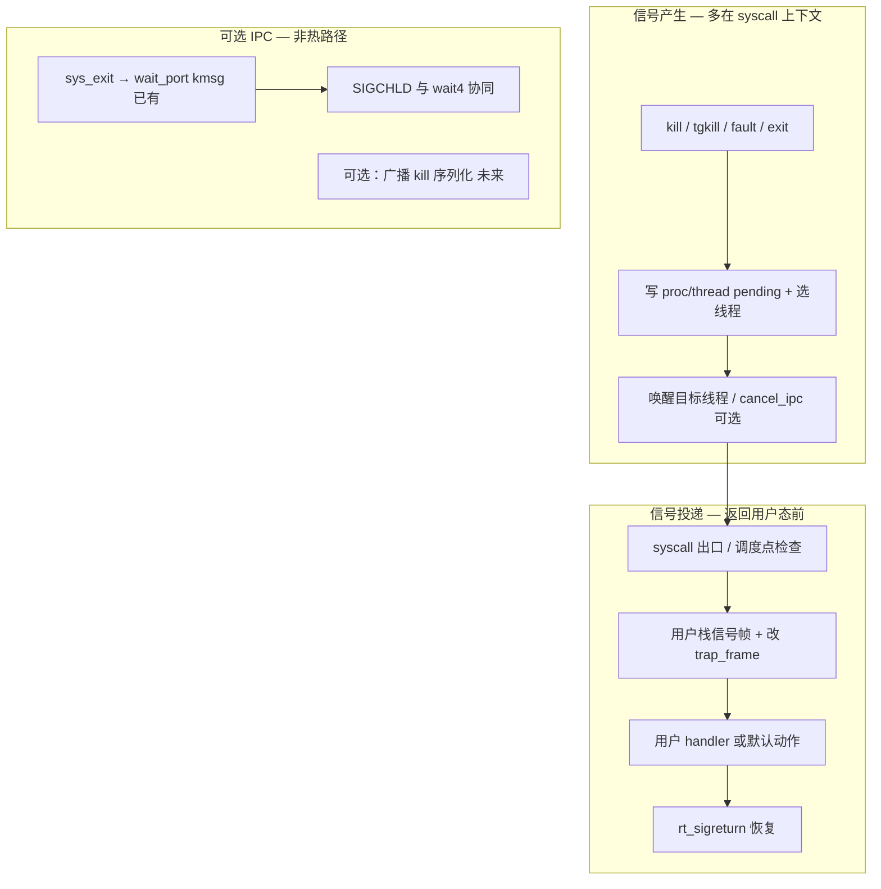

# Linux 兼容信号机制 — IPC 辅助设计（修订版）

**日期**: 2026-05-17（初稿） / 2026-05-16（与代码库对齐修订）  
**状态**: 设计评审通过（有条件实施）  
**相关**: [`ARCHITECTURE.md`](ARCHITECTURE.md)、[`SIGNAL_DELIVERY_TRAP_PATHS.md`](SIGNAL_DELIVERY_TRAP_PATHS.md)、[`SIGNAL_IMPLEMENTATION_STATUS.md`](SIGNAL_IMPLEMENTATION_STATUS.md)、[`SYSCALLS.md`](SYSCALLS.md)

---

## 0. 审查结论（相对初稿的修正）

初稿由外部 AI 提出「用 IPC 信号服务器替代传统 trap 投递」。对照本仓库 **core IPC API**、**`linux_layer` 现状** 与 **`ARCHITECTURE.md` 分层原则** 后，结论如下：

| 初稿主张 | 实际情况 | 修订 |
|----------|----------|------|
| 「无需修改 trap 返回路径」 | Linux 语义要求在 **返回用户态前** 投递可捕获信号；必须改 `trap_frame`、建用户态信号帧、`rt_sigreturn` | **保留 syscall/中断返回钩子**；IPC 不负责代替这一步 |
| `kill()` 一律经 IPC 到中央服务器 | 与「能直接调 core / 直接改 compat 状态则不用 IPC」冲突；且每信号多一次阻塞 `send_msg` + 服务器调度 | **默认在 `linux_layer` 内直接排队 + 唤醒**；IPC 仅用于已有/可选的异步路径 |
| 每线程 `signal_port` + `recv_msg` 收信号 | `recv_msg` 会阻塞；用户线程不应为收信号常驻 IPC 接收 | **取消「每线程信号端口」作为主路径** |
| 阶段 1「已完成」 | `rt_sigaction`/`rt_sigprocmask` 未做用户态拷贝；`kill` 只写进程级 `pending`；无投递、无 `rt_sigreturn` | 标为 **骨架 / 进行中** |
| 伪代码 `msg->data`、`create_kernel_thread` 等 | 本项目消息体为 **`kmsg_t` + `ipc_serial_*`**（见 `clean_server.c`、`sys_exit`） | 下文示例与现有 IPC 一致 |
| 「O(n) 可扩展、减少 trap 检查」 | 投递延迟主要取决于 **何时检查 pending**；省略检查违背 Linux | 性能目标改为「热路径直接写 pending + 单次 defer 检查」 |

**可实施结论**：把 RendezvOS IPC 用作 **可选的异步协调层**（与 `wait4` / `clean_server` 同类），**不能**替代信号投递的核心（pending 队列 + 返回用户态前的 defer 投递）。该修订方案与现有代码兼容，可按阶段落地。

---

## 1. 目标与分层

### 1.1 目标

- 实现 Phase 2B：`rt_sigaction`、`rt_sigprocmask`、`kill`/`tgkill`、`sigaltstack`、`rt_sigreturn` 及与 `wait4`/进程生命周期相关的 **SIGCHLD** 语义。
- 与混合内核一致：**策略在 `linux_layer`，原语在 core，长生命周期/跨 CPU 清理走 server + IPC**。

### 1.2 两层模型（必须同时存在）



- **层 A（产生）**：更新 `linux_proc_append_t` / `linux_thread_append_t` 中的 mask、disposition、pending；必要时唤醒阻塞线程（`thread_set_status`、`cancel_ipc`）。
- **层 B（投递）**：在 **当前线程** 即将返回用户态时调用 `linux_deliver_pending_signals(tf)`（与初稿 §4.2 一致，但明确这是 **主路径**，不是「传统方案要废弃」）。
- **层 C（IPC，可选）**：复用/扩展现有 kmsg，不用于「每个信号一次 server 往返」。

---

## 2. 与现有代码的对齐

### 2.1 已有数据结构（`include/linux_compat/proc_compat.h`）

| 位置 | 已有字段 | 说明 |
|------|----------|------|
| `linux_proc_append_t` | `signal_dispositions[NSIG]`、`pending_signals` | 每进程 disposition + 进程级 pending |
| `linux_thread_append_t` | `blocked_signals`、`pending_signals`、`alt_stack` | 每线程 mask / pending / 备用栈 |

**初稿拟增、当前不建议默认增加**：

- `Message_Port_t *signal_port`（每线程）— 易与阻塞 IPC 语义冲突。
- `signal_server` 中央队列 — 除非明确需要全局 `kill(-1)` 序列化，否则 pending 已在 append 中。

### 2.2 已有 syscall 骨架

| Syscall | 文件 | 状态 |
|---------|------|------|
| `rt_sigaction` | `linux_layer/proc/sys_rt_sigaction.c` | 内核侧 disposition 读写；**缺** `linux_mm_store_to_user` 拷贝 |
| `rt_sigprocmask` | `linux_layer/proc/sys_rt_sigprocmask.c` | 同上 |
| `kill` | `linux_layer/proc/sys_kill.c` | 仅 `sigaddset` 到 **进程** `pending`；**缺** 线程选择、唤醒、默认动作 |
| `sigaltstack` | （若已接表） | 需与投递时栈切换联动 |
| `rt_sigreturn` | 未实现 | 阶段 3 |

### 2.3 已有 IPC 模式（应复用，而非另起炉灶）

- **`wait4`**：父进程 `recv_msg(wait_port)`；子进程 `sys_exit` 经 `kmsg`（`KMSG_MOD_LINUX_COMPAT` / `KMSG_LINUX_EXIT_NOTIFY`）通知 — 见 `linux_layer/proc/sys_wait.c`、`linux_layer/syscall/thread_syscall.c`。
- **`clean_server`**：内核线程 `recv_msg` → `dequeue_recv_msg` → `kmsg_from_msg` → `ipc_serial_decode` — 见 `servers/clean_server.c`。

**SIGCHLD**：优先在 **子进程退出路径** 向父进程 pending 置位 `SIGCHLD`，若父阻塞在 `wait4`，现有 exit kmsg 已可唤醒；不必为每个 SIGCHLD 再经独立 signal server。

---

## 3. 推荐实现策略

### 3.1 原则（摘自 `ARCHITECTURE.md`）

- **页表 / 调度 / pending 位图**：当前 syscall 或 fault 上下文内 **直接调用** core + 读写 append。
- **IPC**：全局单消费者、跨子系统策略、或 **处理线程不能是发起者** 的场景（防止自锁死）。

信号 **排队与 mask 检查** 不需要全局锁序以外的 IPC；**投递** 必须在目标线程上下文的 defer 点完成。

### 3.2 信号产生（`kill` / `tgkill`）— 直接路径

```text
sys_kill / sys_tgkill
  → proc_registry 解析目标 TCB / 线程
  → 权限与 sig==0 存在性检查
  → linux_queue_signal(target, sig, siginfo)   /* 写 thread/proc pending，按 Linux 规则选线程 */
  → 若需立即默认动作（SIGKILL 等）：linux_signal_default_action()
  → 否则若目标阻塞：thread_set_status(ready) 或 cancel_ipc（与 EINTR/wait4 协调）
  → return 0
```

**不默认** `send_msg(signal_server_port)`：避免热路径双上下文切换。

**可选 IPC（阶段 2+，低优先级）**：`kill(-1)` / 进程组广播时，可向 **可选** `signal_coordinator` 发 kmsg 做批量遍历，与 `proc_registry` 锁策略一致；非 Phase 2B 首选项。

### 3.3 信号投递 — defer 检查（主路径）

与初稿 §4.3 **选项 1** 一致，为 **必选**：

- 在 `linux_layer/syscall/syscall_entry.c`（或 arch syscall 出口）**返回用户前**：
  - `linux_deliver_pending_signals(trap_frame *)`
- 在 **时钟/调度返回用户** 的公共路径上同样调用（否则 `pause`、阻塞 syscall 被信号打断会不正确）。

**不采用**：用户线程 `recv_msg(signal_port)` 拉取信号（选项 2/3 仅作调试辅助时可考虑 `sigcheck` 类 syscall，非 Linux 兼容主路径）。

投递内部仍需（初稿阶段 3，无法省略）：

1. 按 RT 优先级与 `pending & ~blocked` 选信号  
2. `SIG_DFL` / `SIG_IGN` / 用户 handler 分支  
3. x86_64 / aarch64 **ucontext + sigframe** 与 **按 arch 修改返回 PC/SP**（x86 syscall：`rcx` + `user_rsp_scratch`；aarch64：`ELR` + `SP` / `SP_EL0`）  
4. `rt_sigreturn` 恢复  

详见 [`SIGNAL_DELIVERY_TRAP_PATHS.md`](SIGNAL_DELIVERY_TRAP_PATHS.md)。

### 3.4 IPC 适用点（收窄后）

| 场景 | 建议 | 理由 |
|------|------|------|
| 子进程退出 → 父 `wait4` | **已有** exit kmsg | 已验证 |
| SIGCHLD pending | **直接** `sigaddset` + 若父在 wait 则已有唤醒 | 避免重复 IPC |
| 跨 CPU 线程 reap | **clean_server** kmsg | 已有 |
| 每进程 `kill(pid,sig)` | **直接** pending | 热路径 |
| `kill(-1)` 广播 | 可选 coordinator + kmsg | 全局序列化时再引入 |
| 用户 handler 执行 | **从不** IPC | 必须在目标线程 user 上下文 |

### 3.5 kmsg 形状（若将来需要 coordinator）

与 `clean_server` / `sys_exit` 一致，**不要**使用 `msg->data`：

```c
/* 示例：linux_layer 内定义 opcode，经 ipc_serial 编码 */
#define KMSG_LINUX_SIGNAL_QUEUE  2u   /* 与 EXIT_NOTIFY 并列，需统一登记 module id */

/* payload 示例格式串: "piii" → target_pid, target_tid, sig, sender_pid */
```

服务器循环模式应复制 `clean_server_thread`：`recv_msg(port)` → `while (dequeue_recv_msg())` → `kmsg_from_msg` → `ref_put`。

---

## 4. 实施阶段（修订）

### 阶段 1 — 数据与 syscall 骨架（进行中）

- [x] `signal_types.h`、`proc_compat` 字段  
- [~] `rt_sigaction` / `rt_sigprocmask`（缺用户内存访问）  
- [~] `kill`（缺线程 pending、唤醒、默认动作）  
- [ ] `sigaltstack`、`tgkill`、`rt_sigpending` 等按 `SYSCALLS.md`  

### 阶段 2 — 产生与排队（无 IPC 服务器）

- [ ] `linux_queue_signal()`：进程/线程 pending、tgkill 线程定向、SIGKILL/SIGSTOP 不可捕获  
- [ ] 与 `find_task_by_pid` / 线程表遍历（进程组 kill 可后置）  
- [ ] 阻塞线程唤醒；`wait4` + `EINTR` 与 `cancel_ipc` 策略（见 `ARCHITECTURE.md` §6）  

### 阶段 3 — 投递与架构相关帧

- [ ] `linux_deliver_pending_signals()` + syscall 出口钩子  
- [ ] 信号帧 / `rt_sigreturn`（x86_64、aarch64）  
- [ ] `SA_RESTART`、`SA_NODEFER`、`SA_ONSTACK` 子集  

### 阶段 4 — 生命周期与测试

- [ ] SIGCHLD 与 `exit_state` / `wait4` 一致  
- [ ] 单测 + 多线程 + 与 `linux_fatal_user_fault`（SIGSEGV）协调  
- [ ] （可选）`signal_coordinator` 仅用于广播 kill  

---

## 5. 风险（修订）

| 风险 | 说明 | 缓解 |
|------|------|------|
| 误以为 IPC 可省略 trap 投递 | 初稿最大误区 | 本文 §1.2；阶段 3 不可砍 |
| `kill` 只写进程 pending | 当前代码问题 | 线程级 pending + `tgkill` |
| IPC 死锁 | 在 syscall 中 `send_msg` 到同步 server | 热路径不用 IPC；server 异步 |
| SMP | pending 与 mask 并发 | append 与 registry 锁策略；参考 `INVARIANTS.md` |
| 与 wait4 重复通知 | exit kmsg + SIGCHLD | 统一在 `sys_exit` 文档化顺序 |

---

## 6. 性能预期（务实）

- **热路径**：`kill` → 内存写 pending + 可能 `thread_set_status` — 目标微秒级，**不**经 server。  
- **投递**：每次 syscall 返回至多一轮 defer（与 Linux 相同量级）；可优化为「pending 非空才检查」。  
- **勿声称**「比传统信号更少 trap 检查」；Linux 兼容必须检查。

---

## 7. 与初稿设计思路的对照（便于阅读）

初稿 **合理部分**（保留）：

1. **每进程 disposition、每线程 mask/pending** — 已与 `proc_compat.h` 一致。  
2. **在 syscall 返回前投递** — 仍是核心。  
3. **专用内核线程处理「重」逻辑** — 仅适用于 **clean_server 类** 工作，不适用于每信号一次。  
4. **与 wait4 / SIGCHLD 集成** — 应走 **exit kmsg + pending**，而非新造并行 IPC 栈。

初稿 **应放弃或降级部分**：

1. 中央 **signal_server** 作为所有 `kill` 的必经路径。  
2. **每线程 signal_port**。  
3. 阶段 1 标为完成。  
4. 用 IPC 完全替代 trap / sigreturn。

---

## 8. 下一步

1. 实现 `linux_queue_signal()` + 修正 `sys_kill`（进程/线程 pending、唤醒）。  
2. 在 syscall 出口挂 `linux_deliver_pending_signals()`（先 x86_64）。  
3. 补全 `rt_sigaction`/`rt_sigprocmask` 用户态拷贝。  
4. 再评估是否真的需要 **可选** `signal_coordinator`（仅 `kill(-1)` / 进程组）。

---

**文档状态**: 已修订；实施状态以 `SIGNAL_IMPLEMENTATION_STATUS.md` 为准  
**版本**: 1.1（代码库对齐）
