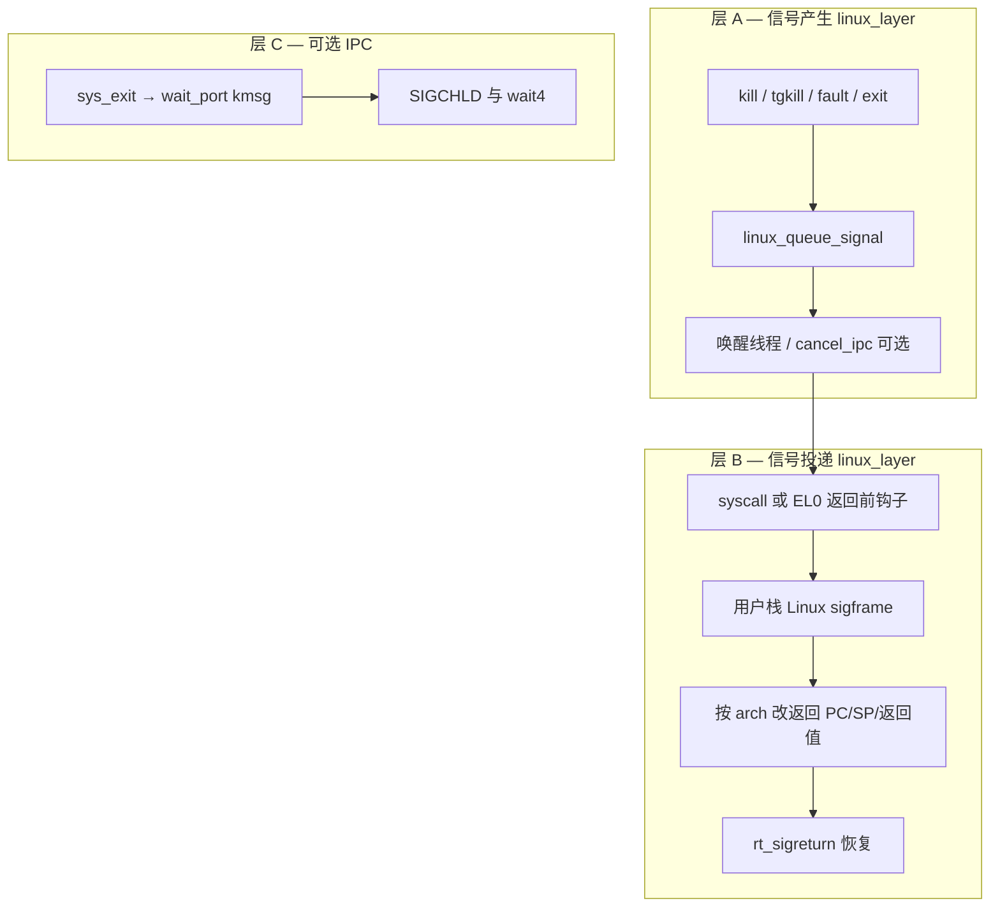

# Linux 兼容层：信号投递与 trap 返回路径

**状态**：实施指南（Phase 2B）  
**读者**：实现 `kill` / `rt_sigaction` / 信号投递的 `linux_layer` 与（必要时）`core` 维护者  
**相关**：
- [`IPC_BASED_SIGNAL_DESIGN.md`](IPC_BASED_SIGNAL_DESIGN.md) — IPC 仅作辅助，不可替代投递
- [`SIGNAL_IMPLEMENTATION_STATUS.md`](SIGNAL_IMPLEMENTATION_STATUS.md) — 实现状态与缺口
- [`BUGFIX_FORK_SYSCALL_STALE_USER_CONTEXT.md`](BUGFIX_FORK_SYSCALL_STALE_USER_CONTEXT.md) — syscall 内 fork 须 `arch_ctx_refresh`
- [`ARCHITECTURE.md`](ARCHITECTURE.md) — 能直接调 core 则不用 IPC

---

## 1. 结论（先读）

| 问题 | 答案 |
|------|------|
| 要不要在 core 里先加 `arch_setup_signal_frame()`？ | **Phase 2B 不必**。Linux `rt_sigframe` / `ucontext` 布局放在 **`linux_layer`**。 |
| 能不能只靠 IPC 信号服务器？ | **不能**。产生信号可直写 pending；**投递**必须在返回用户态前改 trap/返回状态。 |
| 主实现位置？ | `linux_queue_signal()` + `linux_deliver_pending_signals(tf)` + `rt_sigreturn`；钩子挂在 **`syscall_entry.c` 末尾**（及将来的 EL0 返回公共点）。 |
| core 已有啥？ | `struct trap_frame`、`ARCH_SYSCALL_*`、`arch_ctx_refresh`、`arch_return_to_user` / `arch_drop_to_user`、调度与 MM 原语。 |
| x86 与 aarch64 一样吗？ | **不一样**。x86 **syscall 返回**走 `sysretq`，用户 PC/RSP 不在 `trap_frame->rip/rsp`；aarch64 **EL0 返回**主要用帧内 **`ELR`**（及帧内 **`SP` 字段**），并另有 **`SP_EL0`** 上下文。 |

---

## 2. 分层模型



- **层 A**：只改 `linux_proc_append_t` / `linux_thread_append_t`（disposition、mask、pending），必要时 `thread_set_status` / `cancel_ipc`（与 `wait4`、EINTR 协调）。
- **层 B**：在**当前线程**、**当前这条返回用户态的路径**上执行；不阻塞在 `recv_msg`。
- **层 C**：复用现有 exit/wait IPC；见 [`IPC_BASED_SIGNAL_DESIGN.md`](IPC_BASED_SIGNAL_DESIGN.md)。

**core 变更原则**：仅当 x86/aarch64 重复逻辑过多时，可增加**极薄** arch 助手（例如「为当前 syscall 返回设置 user PC + user SP」），**不包含** Linux sigframe 布局。变更前需按仓库规范评审 `core/`。

---

## 3. 数据结构（已有）

定义见 `include/linux_compat/proc_compat.h`、`include/linux_compat/signal/signal_types.h`。

| 位置 | 字段 | 语义 |
|------|------|------|
| `linux_proc_append_t` | `signal_dispositions[NSIG]` | 每进程 handler（`rt_sigaction`） |
| `linux_proc_append_t` | `pending_signals` | 进程级 pending（部分信号） |
| `linux_thread_append_t` | `blocked_signals` | 每线程掩码（`rt_sigprocmask`） |
| `linux_thread_append_t` | `pending_signals` | 每线程 pending |
| `linux_thread_append_t` | `alt_stack` | 备用信号栈（`sigaltstack`） |

**不建议**默认增加每线程 `Message_Port_t *signal_port`（`recv_msg` 会阻塞，与 Linux 投递语义不符）。

---

## 4. core 里与信号相关的机制（只读使用）

### 4.1 统一的 `struct trap_frame`

- 头文件：`core/include/arch/x86_64/trap/trap.h`、`core/include/arch/aarch64/trap/trap.h`
- Syscall 分发：`linux_layer/syscall/syscall_entry.c` 接收 `struct trap_frame *syscall_ctx`，通过 `ARCH_SYSCALL_ID` / `ARCH_SYSCALL_ARG_*` / `ARCH_SYSCALL_RET` 访问。

### 4.2 用户可见上下文刷新（fork / clone 必用）

在 **syscall 上下文**里 fork/clone 时，不能只信 `Thread_Base::ctx` 里缓存的用户 SP/TLS：

- x86：`arch_ctx_refresh()` 从 `percpu(user_rsp_scratch)` 与 FS/GS MSR 回填（见 `core/arch/x86_64/task/arch_thread.c`）。
- aarch64：`arch_ctx_refresh()` 从 `SP_EL0`、`TPIDR_EL0` 回填（见 `core/arch/aarch64/task/arch_thread.c`）。

详见 [`BUGFIX_FORK_SYSCALL_STALE_USER_CONTEXT.md`](BUGFIX_FORK_SYSCALL_STALE_USER_CONTEXT.md)。

### 4.3 两条「返回用户态」路径（两架构共有概念）

| 路径 | 何时发生 | core 入口 | 典型场景 |
|------|----------|-----------|----------|
| **路径 A** | 用户线程**已在运行**，陷入内核后返回 | 见下文 §5 / §6 各 arch | 普通 **syscall**、**页故障** 后返回 |
| **路径 B** | 新线程/子线程**首次**从内核栈上的保存区返回 | `arch_return_to_user(kstack_bottom, …)` → `arch_drop_to_user(tf)` | **fork/clone 子线程**、`run_copied_thread`、ELF 首次进入 |

路径 B 的帧位于 **`((struct trap_frame *)thread->kstack_bottom) - 1`**（`copy_thread` 已拷贝父帧；`run_copied_thread` 只改返回值再 drop）。

**信号投递必须识别当前线程走的是 A 还是 B**；同一 arch 上 A 与 B 修改的字段不同（尤其 x86）。

---

## 5. x86_64：返回路径与信号应改什么

### 5.1 路径 A — 普通 syscall 返回（`sysretq`）

**汇编**：`core/arch/x86_64/trap/kernel_entry.S`

1. `arch_enter_kernel`：在**本次 syscall 专用内核栈**上压寄存器，把 `%rsp` 作为第一个参数传给 `syscall()`。
2. `syscall()`（`linux_layer`）返回后进入 `arch_exit_kernel`：
   - 用户 **返回值** ← 栈上保存的 **`rax`** 槽（`ARCH_SYSCALL_RET`）。
   - 用户 **RIP** ← 栈上保存的 **`rcx`** 槽（**不是** `trap_frame->rip`）。
   - 用户 **RSP** ← **`percpu(user_rsp_scratch)`**（**不是** `trap_frame->rsp`）。
3. `sysretq` 回到用户态。

`syscall_ctx` 指向的内存布局与 `struct trap_frame` **部分一致**（自 `r15` 起），但 **`rip`/`rsp`/`cs` 等字段不在 syscall 压栈路径中使用**。

**投递信号时（路径 A）应修改**：

| 目标 | 修改位置 |
|------|----------|
| 用户 PC → handler | `syscall_ctx->rcx` |
| 用户 SP → 信号帧压栈后的 SP | `percpu(user_rsp_scratch)` |
| Syscall 返回值 / 传给 handler 的 signo | 按 ABI 约定设置 `syscall_ctx->rax` 等 |
| 保存被中断的用户上下文 | 在用户栈构建 **Linux rt_sigframe**，内含原 PC/SP/flags/mask 等 |

**不要**：

- 只改 `syscall_ctx->rip` / `syscall_ctx->rsp` 指望 `sysret` 生效。
- 对正在 syscall 返回的线程调用 `arch_return_to_user()`（那是路径 B）。

**参考压栈顺序**（`kernel_entry.S`）：`r15`…`rdi` 在 `1*8`…`15*8`，`rax` 在 `11*8`，`rcx` 在 `12*8`。

### 5.2 路径 B — `arch_return_to_user` / `arch_drop_to_user`

**代码**：`core/kernel/task/thread.c`（`run_copied_thread`）、`core/arch/x86_64/task/arch_thread.c`

- 帧在 `kstack_bottom - 1` 的完整 `struct trap_frame`。
- `arch_return_to_user` 可设 `template_tf`，并写 **`rax = syscall_ret`**。
- x86 首次进用户常用 **`rcx` 承载用户入口 RIP**（`arch_empty_drop_trap_frame` 注释：sysret 用 rcx）。

**投递信号时（路径 B）**：

- 修改 **`kstack_bottom - 1`** 处 trap 帧：至少 **`rcx`（user PC）**、与 **`arch_drop_to_user` 实际使用的 SP 来源**（常与 `user_rsp_scratch` / `ctx.user_rsp` 一致，需与 `copy_thread` 后状态一致）。
- 若子线程尚未运行过 syscall，通常**不会**经过路径 A，直到第一次 syscall。

### 5.3 x86_64 投递伪代码（路径 A）

```c
/* linux_layer/signal/x86_signal_deliver.c — 示意 */
void linux_x86_deliver_on_syscall_return(struct trap_frame *tf, int sig,
                                         void *handler, vaddr user_sp)
{
        /* 1. 已在 user_sp 下方写好 rt_sigframe（linux_mm_store_to_user） */

        /* 2. 改 sysret 三元组 */
        tf->rcx = (u64)(uintptr_t)handler;
        percpu(user_rsp_scratch) = user_sp;

        /* 3. 可选：tf->rax = (u64)sig; 或保持原 syscall 返回值策略 */
}
```

### 5.4 其它 x86 注意点

- **默认动作**（SIGKILL、SIGSEGV 内核策略等）：可在 `linux_queue_signal` 里直接终止/调用 `linux_fatal_user_fault`，不必建帧。
- **SA_SIGINFO / rt_sigreturn**：帧布局按 Linux x86_64 ABI；`rt_sigreturn` 从新 syscall 恢复路径 A 的寄存器与 `user_rsp_scratch`。
- **与 fork 组合**：父进程 syscall 内 fork 后，父仍走路径 A；子进程首次运行走路径 B（见 BUGFIX 文档）。

---

## 6. AArch64：返回路径与信号应改什么

### 6.1 路径 A — EL0 同步异常 / syscall 返回（`eret`）

**汇编**：`core/arch/aarch64/trap/kernel_entry.S`（`el0_trap_entry` / `el0_trap_exit`）

- 从 EL0 陷入时，在**当前内核栈**上分配 `39*8` 字节保存区，`mov x0, SP` 传给 `trap_handler` → 最终到 `syscall(syscall_ctx)`。
- `el0_trap_exit` 恢复：
  - **`ELR_EL1` ← 帧内保存的 `ELR`（用户 PC）**
  - **`SPSR_EL1` ← 帧内 `SPSR`**
  - 恢复 `x0`–`x28` 等（`REGS[]` 与栈槽对应）
  - 帧内 **`SP` 字段**在退出序列里参与恢复（`mov SP, x21` 等）；**用户栈顶**在 clone 场景下由 compat 写 `trap_frame->SP`（见 `sys_clone.c`）。

**Syscall 约定**（`trap.h`）：

| 宏 | 寄存器 / 字段 |
|----|----------------|
| `ARCH_SYSCALL_ID` | `REGS[8]`（x8） |
| `ARCH_SYSCALL_RET` | `REGS[0]`（x0） |
| `ARCH_SYSCALL_ARG_1` … `_6` | `REGS[0]`…`REGS[5]` |

**投递信号时（路径 A）应修改**：

| 目标 | 修改位置 |
|------|----------|
| 用户 PC → handler | `syscall_ctx->ELR` |
| 用户 SP（若退出路径使用帧内 `SP`） | `syscall_ctx->SP`（与 `sys_clone` 一致） |
| 用户 SP（EL0 栈指针寄存器） | 同时维护 **`Arch_Task_Context.sp_el0`** / 必要时 `msr SP_EL0`（与 `arch_ctx_refresh` 语义一致） |
| Syscall 返回值 | `syscall_ctx->REGS[0]` 或按 handler 调用约定 |
| 保存上下文 | 用户栈 **aarch64 rt_sigframe** |

实现前应在真机上确认：当前 `el0_trap_exit` 与 **SP_EL0** 的组合行为（单测：改 `ELR`+`SP`+`sp_el0` 后返回是否落在预期用户栈）。

### 6.2 路径 B — `arch_return_to_user` / `arch_drop_to_user`

**代码**：`core/arch/aarch64/task/arch_thread.c`

- `dst_tf = (struct trap_frame *)kstack_bottom - 1`
- 设置 `REGS[0] = syscall_ret`，`SP = (u64)dst_tf`（bootstrap 特殊布局，见 core 实现）
- `arch_drop_to_user(dst_tf)`

**clone 子线程**：compat 在 `copy_thread` 之后写 `child_trap_frame->SP = user_stack`（`linux_layer/proc/sys_clone.c`）。

**投递信号时（路径 B）**：

- 改 **`kstack_bottom - 1`** 的 `ELR`、`SP`，以及 handler 需要的 `REGS[]`。
- fork 子进程第一次从 fork/clones 返回前若需投递，在此帧上操作，而非 syscall 临时栈。

### 6.3 AArch64 投递伪代码（路径 A）

```c
/* linux_layer/signal/aarch64_signal_deliver.c — 示意 */
void linux_aarch64_deliver_on_syscall_return(struct trap_frame *tf, int sig,
                                             void *handler, vaddr user_sp)
{
        Thread_Base *th = get_cpu_current_thread();

        /* 1. 用户栈 sigframe 已写好 */

        tf->ELR = (u64)(uintptr_t)handler;
        tf->SP = user_sp;
        if (th) {
                arch_ctx_refresh(&th->ctx);
                th->ctx.sp_el0 = user_sp;
                /* 若实现约定在返回前同步硬件： msr SP_EL0, user_sp */
        }
        /* tf->REGS[0] = sig;  // 若采用标准 handler(int sig) 约定 */
}
```

### 6.4 AArch64 与 x86 对比小结

| 项目 | x86_64 路径 A | aarch64 路径 A |
|------|----------------|-----------------|
| 用户 PC | `syscall_ctx->rcx` | `syscall_ctx->ELR` |
| 用户 SP | `percpu(user_rsp_scratch)` | `syscall_ctx->SP` + `sp_el0` / `SP_EL0` |
| 返回值寄存器 | `rax` | `REGS[0]` (x0) |
| 帧是否完整 `trap_frame` | 部分字段有效 | 布局与 `el0_trap_*` 一致度更高 |
| 路径 B 帧位置 | `kstack_bottom - 1` | 同左 |

---

## 7. `linux_deliver_pending_signals` 职责（arch 无关部分）

建议在 `linux_layer/signal/`（新目录）实现：

```text
linux_deliver_pending_signals(struct trap_frame *tf)
  ├─ 若 !thread_has_pending() → return
  ├─ 按 RT 优先级选 sig；检查 blocked、SIG_DFL/IGN
  ├─ SIG_DFL → linux_signal_default_action()
  ├─ 用户 handler：
  │    ├─ 计算 user_sp（主栈或 alt_stack，16 字节对齐）
  │    ├─ linux_build_sigframe(vs, sp, sig, info, ucontext)  // 仅 compat
  │    └─ #if x86_64 → linux_x86_install_return(tf, handler, sp)
  │       #elif aarch64 → linux_aarch64_install_return(tf, handler, sp)
  └─ 从 pending 清除；更新 signal_pending 标志
```

**用户内存**：一律 `linux_mm_store_to_user` / 从用户读取，禁止直接解引用用户指针。

**钩子位置**：

```c
/* linux_layer/syscall/syscall_entry.c — 末尾 */
syscall_ctx->ARCH_SYSCALL_RET = (u64)ret;
linux_deliver_pending_signals(syscall_ctx);
/* rt_sigreturn: restore 已写 ARCH_SYSCALL_RET，设 skip_syscall_ret_assign */
```

**尚未足够的一点**：线程在 **`recv_msg` 阻塞**、**无 syscall** 时收到信号，须在 **唤醒后** 或 **core EL0 返回公共路径** 再调一次投递（中期在 core 增加 `linux_compat_on_return_to_el0(tf)` 弱符号/回调，或等价机制）。

---

## 8. 与 IPC / wait / SIGCHLD

| 场景 | 做法 |
|------|------|
| 子进程 exit，父 wait4 | 已有 `KMSG_LINUX_EXIT_NOTIFY` → `wait_port`；**不必**再为每次信号走 server |
| SIGCHLD | `linux_queue_signal(parent, SIGCHLD)` + 父已在 wait 时由 exit kmsg 唤醒 |
| kill(pid, sig) | **直接** `linux_queue_signal`，热路径无 IPC |
| kill(-1) 广播 | 可选将来 coordinator + kmsg；非 2B 必须 |

---

## 9. 实施顺序（推荐）

| 步骤 | 内容 | 架构 |
|------|------|------|
| 1 | `linux_queue_signal`；修 `sys_kill` / `tgkill` | 共用 |
| 2 | `rt_sigaction` / `rt_sigprocmask` 用户内存拷贝 | 共用 |
| 3 | `syscall_entry` 末尾钩子 + x86 路径 A 投递 | x86_64 先闭环 |
| 4 | aarch64 路径 A 投递 + 与 clone/fork 路径 B 联调 | aarch64 |
| 5 | `rt_sigreturn` | 两 arch |
| 6 | SIGCHLD、EINTR、`cancel_ipc` 与 wait4 | 共用 |
| 7 | （可选）core 薄 API：`arch_install_syscall_user_return(tf, pc, sp, ret)` | 两 arch |

---

## 10. 测试建议

| 测例 | 覆盖 |
|------|------|
| kill + handler 在 syscall 返回后运行 | 路径 A |
| fork 后子进程 handler | 路径 B（x86/aarch64） |
| 阻塞在 wait4，子 exit 触发 SIGCHLD | 层 C + pending |
| `rt_sigprocmask` 阻塞 / 解除后投递 | mask |
| `sigaltstack` 溢出场景 | alt_stack |
| aarch64 vs x86_64 同一 libc 测例 | 双架构 |

---

## 11. 常见误区（审查清单）

1. 认为改 `trap_frame->rip/rsp` 即可在 **x86 syscall** 上投递信号。  
2. 用 **IPC `recv_msg`** 代替 defer 投递。  
3. fork 时未 **`arch_ctx_refresh`**，信号帧或用户 SP 基于陈旧 `ctx`。  
4. 在 core 实现完整 **Linux sigframe**（应放在 compat）。  
5. 只在 `syscall_entry` 检查信号，忽略 **阻塞唤醒** 后的投递。  
6. **x86 与 aarch64 共用**同一套「改 rip/rsp」逻辑。

---

## 12. 参考源码索引

| 主题 | 路径 |
|------|------|
| x86 syscall 进/出 | `core/arch/x86_64/trap/kernel_entry.S` |
| aarch64 EL0 进/出 | `core/arch/aarch64/trap/kernel_entry.S`、`trap_vec.S` |
| x86 `arch_return_to_user` | `core/arch/x86_64/task/arch_thread.c` |
| aarch64 `arch_return_to_user` | `core/arch/aarch64/task/arch_thread.c` |
| fork 子线程返回 | `core/kernel/task/thread.c`（`run_copied_thread`） |
| clone 改子线程 SP | `linux_layer/proc/sys_clone.c` |
| compat syscall 分发 | `linux_layer/syscall/syscall_entry.c` |
| 用户栈写 | `linux_layer/mm/linux_mm_radix.c`（`linux_mm_store_to_user`） |

---

**文档版本**：1.0  
**最后更新**：2026-05-17
